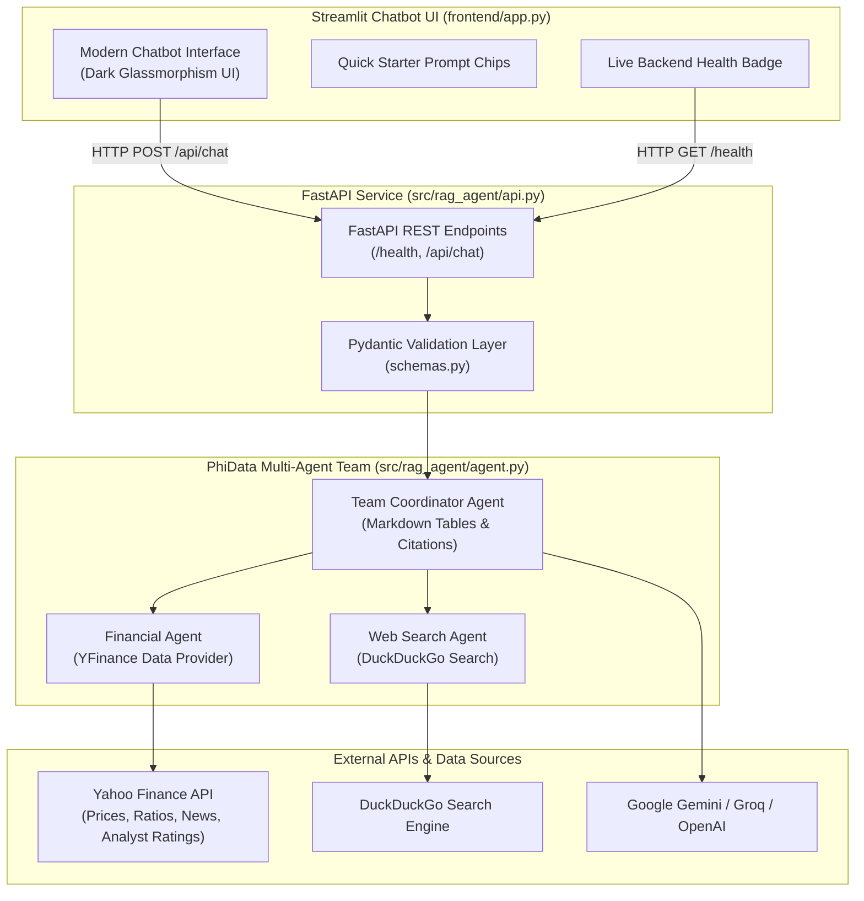

# 💹 Financial AI Multi-Agent Assistant (Phase 1)

[](https://www.python.org/downloads/)
[](https://fastapi.tiangolo.com/)
[](https://streamlit.io/)
[](https://phidata.com/)
[](LICENSE)

An enterprise-ready, autonomous **Financial Intelligence Multi-Agent System** that synthesizes real-time market data, analyst recommendations, company fundamentals, and web news into structured tabular reports and actionable insights.

Built on top of the exploratory prototype in [`financial_agent.ipynb`](financial_agent.ipynb), this Phase-1 release features a decoupled **FastAPI** backend service and a **modern, minimalist Streamlit chatbot** interface.

---

## 🏛️ System Architecture



---

## ✨ Features

- **Autonomous Multi-Agent Orchestration**:
  - **Web Search Agent**: Queries DuckDuckGo for live breaking financial news and market developments.
  - **Financial Analysis Agent**: Gathers stock fundamentals, price targets, analyst consensus, and company profiles via Yahoo Finance (`yfinance`).
  - **Team Coordinator**: Unifies diverse tools into structured, tabular markdown reports with citations.
- **Pure Modern Chatbot UI**: Sleek, distraction-free conversational experience with no extraneous sliders, clean dark-mode glassmorphism styling, and quick question pills.
- **High-Performance FastAPI Backend**: Validated asynchronous REST API with health readiness probes, CORS middleware, and standardized error envelopes.
- **Multi-Model Provider Fallback**: Seamless configuration for **Google Gemini** (`gemini-2.5-flash`), **Groq** (`llama-3.3-70b-versatile`), and **OpenAI**.
- **Automated Quality Assurance**: 100% test pass rate covering Pydantic schemas, agent initialization, and FastAPI endpoints.

---

## 📂 Project Structure

```
rag_agent/
├── .env.example                  # Environment configuration template
├── .env                          # Local secrets (API keys)
├── .gitignore                    # Git ignore specifications
├── pyproject.toml                # Project metadata and uv dependencies
├── requirements.txt              # Pip dependencies
├── README.md                     # Comprehensive project documentation
├── phases.md                     # Multi-phase engineering roadmap
├── financial_agent.ipynb         # Original reference notebook
├── src/
│   └── rag_agent/
│       ├── __init__.py           # Package exports
│       ├── config.py             # App settings & env loader
│       ├── schemas.py            # Pydantic request/response models
│       ├── agent.py              # PhiData multi-agent team implementation
│       └── api.py                # FastAPI REST application & endpoints
├── frontend/
│   ├── app.py                    # Streamlit pure chatbot application
│   └── styles.css                # Modern CSS design system
└── tests/
    ├── __init__.py
    ├── test_config.py            # Configuration loading unit tests
    ├── test_schemas.py           # Schema validation tests
    ├── test_agent.py             # Agent creation and fallback tests
    └── test_api.py               # FastAPI TestClient endpoint tests
```

---

## ⚡ Quick Start

### 1. Prerequisites
- Python `3.10` or higher (Python `3.14` supported)
- [uv](https://github.com/astral-sh/uv) (recommended) or standard `pip`

### 2. Environment Configuration
Create a `.env` file in the project root based on `.env.example`:

```bash
cp .env.example .env
```

Edit `.env` with your API keys:
```env
# At least one LLM API key is required:
GOOGLE_API_KEY="your_gemini_api_key"
GROQ_API_KEY="your_groq_api_key"

# Server configuration
API_HOST="127.0.0.1"
API_PORT=8000
FASTAPI_BACKEND_URL="http://127.0.0.1:8000"
```

### 3. Installation

Using `uv` (Fastest):
```powershell
uv sync
```

Using `pip`:
```powershell
pip install -r requirements.txt
```

---

## 🚀 Running the Application

### Step 1: Launch FastAPI Backend Service
In your first terminal:

```powershell
# With activated venv:
uvicorn src.rag_agent.api:app --reload --port 8000

# Or with uv:
uv run --no-sync uvicorn src.rag_agent.api:app --reload --port 8000
```
> The interactive Swagger API docs will be available at: **http://127.0.0.1:8000/docs**

### Step 2: Launch Streamlit Chatbot UI
In a **second terminal** (with virtual environment activated):

```powershell
# With activated venv:
streamlit run frontend/app.py

# Or with uv:
uv run --no-sync streamlit run frontend/app.py
```
> The Streamlit chatbot UI will open at: **http://localhost:8501**

> [!NOTE]
> When running both the backend and frontend simultaneously on Windows, using `streamlit run frontend/app.py` or `uv run --no-sync` prevents file-lock conflicts on shared compiled binaries.

---

## 📡 API Reference

### Health Check
```http
GET /health
```
**Response (200 OK):**
```json
{
  "status": "healthy",
  "version": "0.1.0",
  "agent_ready": true,
  "model_provider": "Gemini",
  "model_id": "Gemini (gemini-2.5-flash)"
}
```

### Chat Completion
```http
POST /api/chat
Content-Type: application/json
```
**Request Body:**
```json
{
  "message": "Summarize analyst recommendations and share the latest news for Nvidia",
  "session_id": "sess_user_01"
}
```

**Response (200 OK):**
```json
{
  "response": "### NVIDIA Corporation (NVDA) Analysis\n\n| Metric | Current Value |\n|---|---|\n| Stock Price | $124.50 |\n| Analyst Consensus | Strong Buy |\n...",
  "session_id": "sess_user_01",
  "status": "success",
  "model_used": "Gemini (gemini-2.5-flash)"
}
```

#### cURL Example:
```bash
curl -X POST "http://127.0.0.1:8000/api/chat" \
  -H "Content-Type: application/json" \
  -d '{"message": "Summarize analyst recommendations for Apple (AAPL)"}'
```

---

## 🧪 Testing

Run the automated test suite with `pytest`:

```powershell
# With activated venv:
pytest -v

# Or with uv:
uv run --no-sync pytest -v
```

---

## 🗺️ Project Roadmap

For complete details on upcoming phases (Memory, Streaming Charts, SEC RAG, Cloud Deployment), see [phases.md](phases.md).

- **Phase 1 (Current)**: Foundation & Core Multi-Agent Assistant with FastAPI & Streamlit.
- **Phase 2**: Persistent Memory & Portfolio Tracking.
- **Phase 3**: Real-Time Streaming & Interactive Plotly Charts.
- **Phase 4**: Advanced SEC RAG (10-K / 10-Q) & Vector Indexing.
- **Phase 5**: Production Hardening, Dockerization & CI/CD.

---

## 📄 License
This project is licensed under the MIT License.
